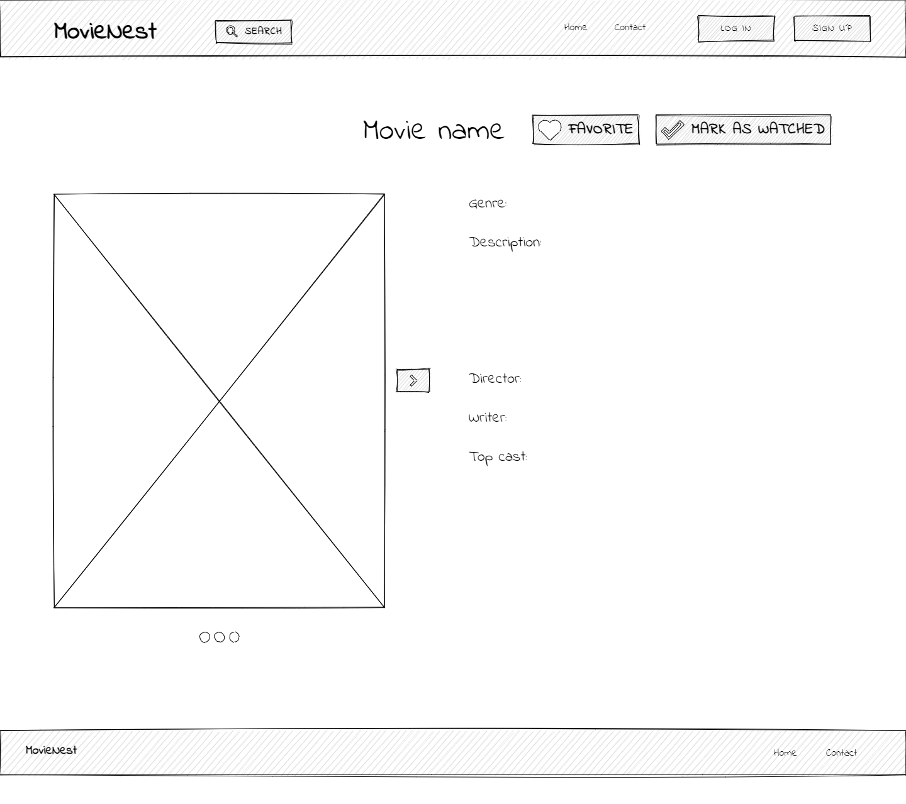

## Projekti nimi

MovieNest

## Kirjeldus

Projekti eesmärgiks on pakkuda filmihuvilistele võimalust leida uusi huvipakkuvaid filme ja hallata oma filmide vaatamist. Täpsemalt on rakenduses võimalik lisaks uute filmide otsimisele erinevate parameetrite abil ka lisada filme oma vaadatud filmide nimekirja või soovilisti, et oleks kergem järge pidada juba nähtud ja nägemata filmide üle. Vaadatud filme saab märkida ka lemmikuteks. Oma filminimekirjadest on võimalik filme lisada, kustutada ja nende staatust muuta. Filminimekirjadele saab ligi oma kasutajakontoga ja nende alusel soovitab rakendus kasutajale potentsiaalselt sobivaid filme. Otsingufunktsiooni kasutades on võimalik tulemusi filtreerida.

## Funktsionaalsused

- Filmide kuvamine pealehel kategooriate järgi;
- Filmide otsimine parameetrite abil;
- Otsingutulemuste filtreerimine;
- Filmide detailse info kuvamine detailvaates; Hiljem vaatamiseks märkimine;
- Sisse logimine/Välja logimine/Registreerumine;
- Vaadatuks märkimine ja selle tagasi võtmine;
- Lemmikuks märkimine ja selle tagasi võtmine;
- Soovitatud filmide, lemmikfilmide, hiljem vaatamiseks ja vaadatud filmide kuvamine oma lehel vastavalt kasutajakontole;

## Wireframe

Homepage (not logged in)

Login

Register

My page

Search

Movie detail view

Contact page

